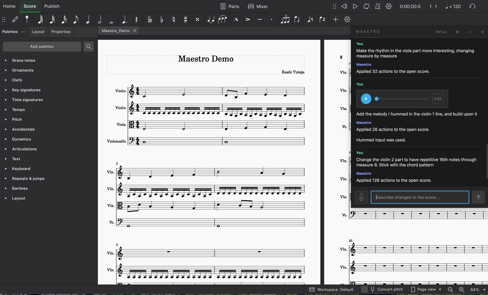

# Maestro



Maestro is an open-source beta macOS desktop companion for live MuseScore editing. It is not a standalone notation editor.

## How AI-Assisted Composition Works

1. Prompt a musical change or hum an idea into Maestro.
2. Maestro asks a model for score-edit code and turns that result into score operations.
3. Those operations are applied to a live MuseScore session through `Maestro Plugin`.

Maestro `v0.1.1` is the current public beta release.

- License: [MIT](LICENSE)
- Disclaimer: [DISCLAIMER.md](DISCLAIMER.md)
- Credits: [AUTHORS.md](AUTHORS.md)
- GitHub release: [v0.1.1](https://github.com/TidalTunes/Maestro/releases/tag/v0.1.1)

## macOS Quick Start

1. Open the [v0.1.1 release page](https://github.com/TidalTunes/Maestro/releases/tag/v0.1.1).
2. Download `Maestro-v0.1.1-macOS-unsigned.dmg`.
   Fallback: `Maestro-v0.1.1-macOS-unsigned.zip`.
3. Open the DMG and drag `Maestro.app` into `Applications`, or unzip the ZIP and move `Maestro.app` wherever you prefer.
4. Launch `Maestro.app`.
5. Before generating edits, make sure you currently have either an OpenAI API key or an Ollama account/setup ready.
6. Use the in-app setup flow to install `Maestro Plugin`, open MuseScore, and verify the bridge connection.
7. Open the provider settings in Maestro. The app remembers non-secret settings locally, and on macOS it stores an OpenAI API key in Keychain when you save one.
8. Keep `Maestro Plugin` open in MuseScore while you work.
9. If you need to report a beta issue, use `Diag` in the app header to copy a local diagnostics bundle with version info, provider mode, plugin status, and recent logs. On macOS, the local log file lives at `~/Library/Logs/Maestro/maestro.log`.

### Unsigned App Warning

`v0.1.1` is not signed or notarized.

On first launch:

1. Right-click `Maestro.app`.
2. Click `Open`.
3. Confirm the warning dialog.

If macOS blocks the app again:

1. Open `System Settings`.
2. Go to `Privacy & Security`.
3. Click `Open Anyway` for Maestro.

## Manual Setup for Windows, Linux, or Source-Based macOS Use

If you do not want the packaged macOS app, use the plugin + Python combo directly from source.

### 1. Install Prerequisites

- Python 3.10 or newer
- MuseScore 4
- Git
- either an OpenAI API key or an Ollama account/setup, depending on which provider you want to use

### 2. Clone the Repository

```bash
git clone https://github.com/TidalTunes/Maestro.git
cd Maestro
```

### 3. Create a Virtual Environment and Install Maestro

macOS or Linux:

```bash
python3 -m venv .venv
source .venv/bin/activate
python -m pip install --upgrade pip
python -m pip install -r requirements-desktop.txt
```

Windows PowerShell:

```powershell
py -3 -m venv .venv
.venv\Scripts\Activate.ps1
python -m pip install --upgrade pip
python -m pip install -r requirements-desktop.txt
```

### 4. Install the MuseScore Plugin

From the activated environment:

```bash
maestro-install-plugin install
```

If MuseScore uses a non-default plugin folder, install to it explicitly:

```bash
maestro-install-plugin install --plugin-dir "<your MuseScore plugin folder>"
```

Default MuseScore 4 plugin folders:

| Platform | Default plugin folder |
| --- | --- |
| macOS | `~/Documents/MuseScore4/Plugins` |
| Windows | `C:\Users\<User>\Documents\MuseScore4\Plugins` |
| Linux | `~/Documents/MuseScore4/Plugins` |

You can inspect the detected location at any time with:

```bash
maestro-install-plugin status
```

### 5. Enable the Plugin in MuseScore

In MuseScore:

1. Open the plugin manager.
2. Enable `Maestro Plugin`.
3. Run `Plugins > Maestro > Maestro Plugin`.
4. Keep that plugin window open while Maestro is sending edits.

### 6. Launch the Python App

If you want to use OpenAI, set your key first:

macOS or Linux:

```bash
export OPENAI_API_KEY="your-key-here"
python maestro_gui.py
```

Windows PowerShell:

```powershell
$env:OPENAI_API_KEY="your-key-here"
python maestro_gui.py
```

If you want to use Ollama instead, make sure your Ollama account/setup is ready and that Ollama is installed and running before you launch Maestro, then choose the Ollama-backed model inside the app.

Manual source installs do not use the macOS app wrapper, Keychain-backed key storage, or the in-app diagnostics shortcut. For those setups, keep using environment variables such as `OPENAI_API_KEY`.

## Developers

Maestro is developed by:

- Kashi Tuteja — Lead
- Arthur Gilfanov
- Matthew Li

We are students at Yale University.

## Build and Developer Notes

For engineering docs and packaging internals:

- [Desktop app notes](apps/frontend-desktop/README.md)
- [Plugin asset notes](apps/plugin/README.md)
- [Bridge package notes](packages/maestro-musescore-bridge/README.md)
- [macOS packaging scripts](packaging/macos/README.md)
- [Repository docs](docs/README.md)
